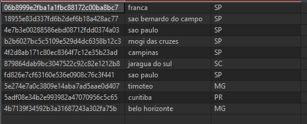
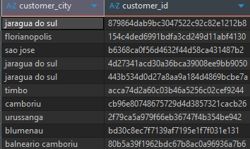
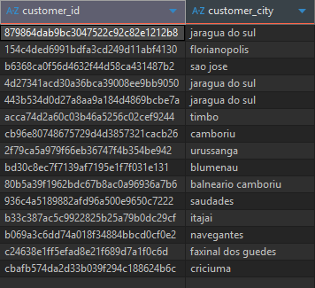
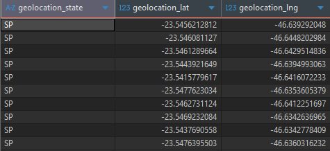
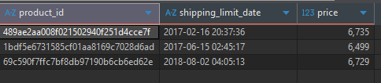
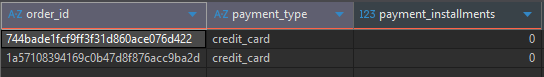

## 📄 Resumo Analítico

Este conjunto de consultas foca em filtros e segmentações fundamentais para a análise de dados. As perguntas abordam três pilares principais:

1.  **Segmentação Geográfica de Clientes:** Consultas para localizar clientes em diferentes níveis (geral, por estado e por cidade).
2.  **Segmentação de Produtos e Pedidos:** Filtros para identificar produtos de alto valor e pedidos com características específicas (como pagamento à vista).
3.  **Filtros Temporais:** Seleção de dados com base em datas específicas para análises históricas.

O objetivo é extrair subconjuntos de dados muito específicos de tabelas de clientes, produtos e pedidos.

## ❓ Desafios e Consultas SQL

Abaixo está o detalhamento de cada consulta solicitada.

* **Arquivo de Resposta:** [`Conjunto de Perguntas1.sql`](./Conjunto%20de%20Perguntas1.sql)

### 1. Localização Geral dos Clientes
> **Pergunta:** Gere uma tabela com o id do cliente, a cidade e o estado onde ele vive.

* **Objetivo:** Criar uma visão geral da distribuição geográfica de todos os clientes cadastrados.

  
Clique para ver o Resultado

  
  

### 2. Clientes de Santa Catarina
> **Pergunta:** Gere uma tabela com o id do cliente e a cidade, somente dos clientes que vivem em Santa Catarina.

* **Objetivo:** Filtrar a base de clientes para focar especificamente naqueles localizados no estado de Santa Catarina.

  
Clique para ver o Resultado

  
  

### 3. Clientes de Florianópolis
> **Pergunta:** Gere uma tabela com o id do cliente e o estado, somente dos clientes que vivem em Florianópolis.

* **Objetivo:** Identificar clientes de uma cidade específica (Florianópolis) e mostrar o estado correspondente.

  
Clique para ver o Resultado

  
  

### 4. Coordenadas de São Paulo
> **Pergunta:** Gere uma tabela com o estado, latitude e longitude do estado de São Paulo.

* **Objetivo:** Obter dados geográficos (latitude e longitude) de uma tabela de geolocalização, filtrando apenas pelo estado de São Paulo.

  
Clique para ver o Resultado

  
  

### 5. Produtos de Alto Valor
> **Pergunta:** Gere uma tabela com o id do produto, a data de envio e o preço, somente para produtos acima de 6300.

* **Objetivo:** Identificar produtos "premium" ou de alto valor, aplicando um filtro numérico para mostrar apenas itens com `preço > 6300`.

  
Clique para ver o Resultado

  
  

### 6. Pedidos com Parcela Única
> **Pergunta:** Gere uma tabela com o id do pedido, o tipo de pagamento e o número de parcelas, somente para produtos com parcelas menores que 1.

* **Objetivo:** Isolar pedidos que foram pagos em uma única vez (à vista), o que geralmente é representado por 0 parcelas (`parcelas < 1`).

  
Clique para ver o Resultado

  
  

### 7. Pedidos Antigos Aprovados
> **Pergunta:** Gere uma tabela com o id do pedido, id do cliente, o status do pedido e a data de aprovação, somente para compras aprovadas até dia 05 de Maio de 2016.

* **Objetivo:** Realizar uma análise temporal, buscando um subconjunto de pedidos históricos que foram aprovados em ou antes de uma data específica (`2016-05-05`).

  
Clique para ver o Resultado

  
  

